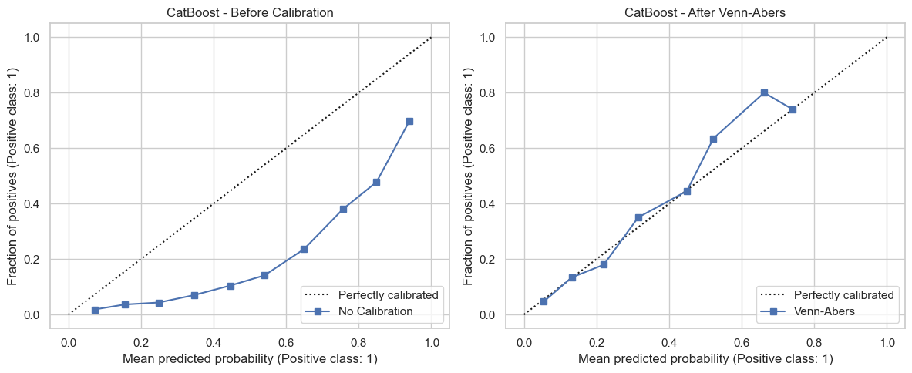

# Probabilistic Modeling for Customer Prioritization in a Banking Marketing Campaign

## Table of Contents

1. [Overview](#overview)
2. [Dataset](#dataset)
3. [Business Problem](#business-problem)
4. [Key Business Assumption](#key-business-assumption)
5. [Classification Errors](#classification-errors)
   - [False Positive](#false-positive)
   - [False Negative](#false-negative)
6. [Key Data Decisions](#key-data-decisions)
   - [Removing `duration`](#removing-duration)
   - [Handling `unknown` Values](#handling-unknown-values)
   - [Handling `pdays = -1`](#handling-pdays--1)
   - [Transforming `day`](#transforming-day)
7. [Evaluation Strategy](#evaluation-strategy)
8. [Models Tested](#models-tested)
9. [Threshold Optimization](#threshold-optimization)
10. [Hyperparameter Tuning](#hyperparameter-tuning)
11. [Probability Calibration](#probability-calibration)
12. [Final Model](#final-model)
13. [Business Impact](#business-impact)
14. [Explainability](#explainability)
    - [Global Feature Importance](#global-feature-importance)
    - [Local Explanation with Calibrated Explanations](#local-explanation-with-calibrated-explanations)
15. [Production Usage and MLOps](#production-usage-and-mlops)
16. [Monitoring](#monitoring)
17. [Technologies Used](#technologies-used)
18. [Project Structure](#project-structure)
19. [How to Run](#how-to-run)
20. [Conclusion](#conclusion)

---

## Overview

This project develops a complete Data Science pipeline to predict whether a customer will subscribe to a **term deposit** after a banking marketing campaign.

The goal is not only to build a binary classifier, but to create a probabilistic model capable of:

- estimating each customer's probability of subscription;
- calibrating predicted probabilities;
- estimating uncertainty associated with each prediction;
- supporting customer prioritization for sales and marketing teams;
- explaining model behavior both globally and locally.

The final solution is designed as a decision-support tool that helps marketing and sales teams prioritize customers based on their estimated conversion probability.

> This is a **propensity model**, not an uplift model.  
> It estimates which customers are more likely to subscribe, but it does not directly estimate the incremental effect of contacting each customer.

---

## Dataset

The dataset used in this project is the **Bank Marketing Dataset**, based on marketing campaigns from a Portuguese banking institution.

- Dataset: https://www.kaggle.com/datasets/abdelazizsami/bank-marketing/data
- Related paper: http://hdl.handle.net/1822/14838
- BibTeX: http://www3.dsi.uminho.pt/pcortez/bib/2011-esm-1.txt

The target variable is:

- `y = yes`: the customer subscribed to the term deposit;
- `y = no`: the customer did not subscribe.

The positive class represents customers who subscribed to the product.

---

## Business Problem

Marketing campaigns have operational costs and limited contact capacity. If customers are selected randomly, the sales or marketing team may spend effort contacting customers with low likelihood of conversion.

The main business question is:

> Which customers are more likely to subscribe to the term deposit and should therefore be prioritized?

The model supports campaign prioritization by ranking customers according to their calibrated probability of subscription.

---

## Key Business Assumption

This project assumes that the main business goal is to **maximize expected conversions under limited contact capacity**.

In this context, the model should be used to prioritize customers with higher predicted probability of subscription.

However, if the business objective were to identify customers who would subscribe **only if contacted**, then this would require an **uplift modeling** approach with treatment/control data.

---

## Classification Errors

Since this is a business decision problem, it is important to define the cost of classification errors.

### False Positive

The model predicts that a customer is likely to subscribe, but the customer does not subscribe.

In this context, a false positive may be risky because the business could incorrectly assume that this customer is already highly likely to convert and reduce commercial effort toward them.

### False Negative

The model predicts that a customer is unlikely to subscribe, but the customer would actually subscribe.

This may lead to missed opportunities or lower campaign efficiency.

Given this business interpretation, the project gave special attention to reducing false positives and prioritized metrics such as:

- Precision;
- F0.5-score;
- PR-AUC.

---

## Key Data Decisions

### Removing `duration`

The variable `duration` represents the duration of the last contact with the customer.

Although it has strong predictive power, it is only known after the call has already happened. Since the model is intended to support decisions before the campaign action, using this variable would create **data leakage**.

For this reason, `duration` was removed from the modeling stage.

---

### Handling `unknown` Values

Some categorical variables contained `unknown` values, especially:

- `job`;
- `education`;
- `contact`;
- `poutcome`.

These values were kept as separate categories instead of being removed or imputed.

The reasoning is that missing categorical information may itself carry predictive signal. For example, most `unknown` values in `poutcome` were associated with customers who had not been contacted in previous campaigns.

---

### Handling `pdays = -1`

The variable `pdays` represents the number of days since the customer was last contacted in a previous campaign.

The value `-1` means that the customer had not been contacted before. Treating `-1` as a regular numerical value would be misleading.

Two variables were created to replace `pdays`:

- `was_previously_contacted`: indicates whether the customer had been contacted before;
- `pdays_since_previous_contact`: number of days since the previous contact, set to `0` when no previous contact existed.

The original `pdays` variable was not used in the final model.

---

### Transforming `day`

The variable `day` represents the day of the month when the contact occurred.

Since the 30th day of the month should not be interpreted as “three times larger” than the 10th day, it was grouped into periods:

- beginning of the month;
- middle of the month;
- end of the month.

The original `day` variable was then removed.

---

## Evaluation Strategy

The dataset is imbalanced, with only approximately **11.7%** positive cases. Therefore, accuracy was not used as the main evaluation metric.

A model that always predicts the majority class would achieve high accuracy but would not identify any potential subscribers.

The following metrics were prioritized:

| Metric | Purpose |
|---|---|
| Precision | Controls false positives |
| Recall | Measures how many actual subscribers were identified |
| F0.5-score | Gives more weight to Precision than Recall |
| PR-AUC | Evaluates ranking quality in an imbalanced dataset |
| Brier Score | Evaluates probability quality |
| Log Loss | Penalizes incorrect probability estimates, especially confident wrong predictions |
| Calibration Curve | Shows whether predicted probabilities match observed frequencies |

A `DummyClassifier` was used as a baseline to validate whether the trained models added value beyond a naive strategy.

---

## Models Tested

The following models were evaluated:

- DummyClassifier;
- Logistic Regression;
- Naive Bayes;
- SVM;
- Random Forest;
- CatBoost.

CatBoost was selected as the main candidate because it showed:

- the best PR-AUC among the evaluated models;
- good performance after threshold adjustment;
- strong ability to work with categorical variables;
- results consistent with the exploratory analysis.

---

## Threshold Optimization

Instead of using the default classification threshold of `0.5`, different thresholds were evaluated.

Since false positives were considered especially relevant, the threshold was selected using the **F0.5-score**, which gives more weight to Precision than Recall.

For the base CatBoost model, the best threshold was approximately:

```text
threshold = 0.81
```

For the calibrated model, the best threshold was:

```text
threshold = 0.41
```

### Base vs. Calibrated Model

| Model | Threshold | Precision | Recall | F0.5 | PR-AUC | Brier Score | Log Loss | Total Predicted Positives |
|---|---:|---:|---:|---:|---:|---:|---:|---:|
| CatBoost Base | 0.81 | 0.5696 | 0.3790 | 0.5176 | 0.4533 | 0.1512 | 0.4824 | 704 |
| CatBoost + Venn-Abers | 0.41 | 0.5340 | 0.4159 | 0.5053 | 0.4360 | 0.0811 | 0.2838 | 824 |

The calibrated model slightly reduced some ranking/classification metrics but substantially improved probability quality.

---

## Hyperparameter Tuning

Hyperparameter tuning was performed using Optuna.

The tuned CatBoost model became more conservative than the base model. It improved Precision from `0.5696` to `0.6077` and reduced false positives from `303` to `215`.

However, this improvement came at the cost of lower Recall, which decreased from `0.3790` to `0.3147`. The number of true positives also decreased from `401` to `333`, while false negatives increased from `657` to `725`.

The tuned model had slightly lower F0.5-score and PR-AUC than the base model:

| Model | Threshold | Precision | Recall | F0.5 | PR-AUC | Brier Score | Log Loss | Total Predicted Positives |
|---|---:|---:|---:|---:|---:|---:|---:|---:|
| CatBoost Base | 0.81 | 0.5696 | 0.3790 | 0.5176 | 0.4533 | 0.1512 | 0.4824 | 704 |
| CatBoost Tuned | 0.84 | 0.6077 | 0.3147 | 0.5123 | 0.4523 | 0.1507 | 0.4810 | 548 |

Although Brier Score and Log Loss improved marginally, the gains were too small to justify replacing the base model.

Therefore, the tuned CatBoost was considered a more conservative alternative, while the base CatBoost was kept as the main model due to its better overall balance between Precision, Recall, F0.5-score, PR-AUC and true positives captured.

---

## Probability Calibration

The base CatBoost model showed good ranking ability, but its predicted probabilities were overestimated.

Therefore, probability calibration was applied using **Venn-Abers**.

The goal of calibration was to make predicted probabilities more reliable. For example, among customers predicted with approximately 70% probability of subscription, around 70% should actually subscribe.

### Calibration Results

| Model | Brier Score | Log Loss |
|---|---:|---:|
| CatBoost Base | 0.1512 | 0.4824 |
| CatBoost + Venn-Abers | 0.0811 | 0.2838 |

The calibrated model reduced Brier Score and Log Loss by almost 50%, indicating much more reliable probabilities.

The calibration curve is shown below:



Since the project objective involves probabilistic decision-making and risk estimation, the calibrated model was considered more appropriate for business use.

---

## Final Model

The final selected solution was:

```text
CatBoost + Venn-Abers calibration
```

With the calibrated model, the selected threshold was:

```text
threshold = 0.41
```

The calibrated model produces:

- calibrated probability of subscription;
- final predicted class;
- uncertainty interval for the prediction;
- a more reliable probability score for business decision-making.

---

## Business Impact

To translate model performance into business value, the model was compared against a random customer selection strategy.

In the test set, the average subscription rate was approximately:

```text
11.7%
```

This means that if the marketing team selected customers randomly, around 11.7 out of every 100 contacted customers would be expected to subscribe.

Using the calibrated model and the selected threshold, the prioritized group had an observed subscription rate close to:

```text
53.4%
```

For the same number of contacted customers:

| Strategy | Customers Contacted | Expected Subscription Rate | Expected Subscriptions |
|---|---:|---:|---:|
| Random selection | 824 | 11.7% | ~96 |
| Model-based selection | 824 | 53.4% | ~440 |

This represents approximately:

```text
+344 incremental subscriptions
~4.6x lift compared to random selection
```

In practical terms, the model does not necessarily increase the number of calls. Instead, it improves the quality of the contact list, allowing the sales team to focus on customers with much higher expected conversion probability.

### Important Note

This analysis is based on a historical test set. It indicates the potential value of the model, but it does not guarantee the same result in production.

The ideal validation would be an A/B test comparing:

- a group selected by the current strategy or random selection;
- a group prioritized by the model.

This would make it possible to measure the real incremental conversion gain.

---

## Explainability

Two explainability approaches were used.

### Global Feature Importance

Feature importance from CatBoost showed that the most relevant variables were:

- `month`;
- `balance`;
- `poutcome`;
- `contact`;
- `job`;
- `age`;
- `day_period`;
- `campaign`.

These variables are consistent with the exploratory analysis, since they are related to:

- campaign timing;
- customer financial profile;
- previous campaign outcome;
- contact channel;
- occupational profile.

Feature importance should not be interpreted as causality. It only indicates which variables were most useful to the model for prediction.

---

### Local Explanation with Calibrated Explanations

A local explanation was generated for one specific prediction using https://github.com/Moffran/calibrated_explanations.

This made it possible to understand which features increased or decreased the predicted probability for a specific customer.

In one example, the following factors increased the probability of subscription:

- `contact = cellular`;
- `poutcome = success`;
- `month = jun`;
- `default = no`;
- `age > 60.5`;
- `job = retired`;
- `campaign <= 1.5`;
- `housing = no`.

The main negative factor in that local explanation was:

- `pdays_since_previous_contact > 14.5`.

This explanation is local and describes the model behavior for one customer. It should not be interpreted as a general causal rule.

---

## Production Usage and MLOps

In production, the model could be used as a commercial prioritization engine.

For each new customer base, the pipeline should:

1. apply the same preprocessing rules used during training;
2. generate the calibrated probability of subscription;
3. estimate prediction uncertainty;
4. apply the selected threshold;
5. assign the final predicted class;
6. return a prioritized customer list.

The expected output for each customer could include:

- customer identifier;
- calibrated probability of subscription;
- uncertainty interval;
- final predicted class;
- threshold used;
- model version.

---

## Monitoring

After deployment, the model should be continuously monitored.

Key monitoring points include:

- input feature distributions;
- unseen or new categorical levels;
- distribution of predicted probabilities;
- number of customers classified as positive;
- Precision;
- Recall;
- F0.5-score;
- PR-AUC;
- Brier Score;
- Log Loss;
- calibration quality over time.

The model should be retrained or reviewed when:

- performance decreases significantly;
- probability calibration worsens;
- the customer profile changes;
- many new categories appear;
- the commercial strategy changes;
- enough new labeled data becomes available.

---

## Technologies Used

- Python;
- pandas;
- numpy;
- matplotlib;
- seaborn;
- scikit-learn;
- CatBoost;
- Optuna;
- MAPIE;
- calibrated-explanations;
- joblib.

---

## Project Structure

```text
.
├── bank-full.csv
├── Notebook.ipynb
├── requirements.txt
├── README.md
└── artifacts/
    └── catboost_venn_abers_artifacts.pkl
```

---

## How to Run

Install the dependencies:

```bash
pip install -r requirements.txt
```

Or using `uv`:

```bash
uv pip install -r requirements.txt
```

Then run the notebook:

```bash
jupyter notebook Notebook.ipynb
```

---

## Conclusion

This project showed that it is possible to build a model that supports banking marketing campaigns by prioritizing customers with higher probability of subscription.

The final solution:

- outperformed a naive baseline;
- generated calibrated probabilities;
- enabled uncertainty-aware decision-making;
- provided global and local explainability;
- can be integrated into a production workflow with monitoring and retraining.

From a business perspective, the model showed a potential lift of approximately **4.6x** compared to random customer selection for the same number of contacted customers.

The main value of the model is not simply predicting `yes` or `no`, but helping commercial teams allocate effort more efficiently by focusing on customers with higher expected conversion probability.

